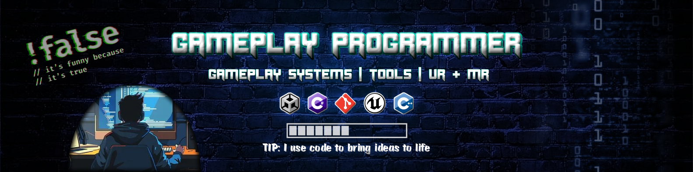
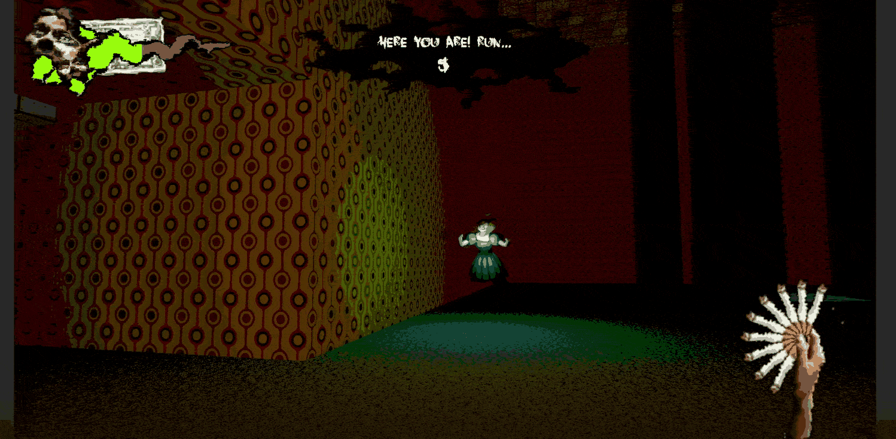

# Alan Safonov

## Gameplay & Tools Programmer, AI Workflow Designer & Agent Engineer

### Unity 6 / C#, Unreal Engine 5 / C++, Claude Code, Codex

#### *"I build systems other people use & author against."*

- 📍 Netherlands, Remote
- 🎯 Open to Unity/Unreal gameplay & tools roles — and to AI workflow / agent engineering work
- 🔗 [Portfolio](https://theawedev.webflow.io/) · [LinkedIn](https://www.linkedin.com/in/alansafonov) · [itch.io](https://awedev.itch.io/) · [Other Links](https://linktr.ee/awedev)

### Experience
- Unreal Engine Game/Tools Programmer Intern @ **Vertigo Games** *(2025)* ▸ [Product Showoff](https://theawedev.webflow.io/#handposeeditor) · [Video](https://youtu.be/9_KtpXtQr0I?si=VK72Zuk7rTDtkpLV)
- Unity Developer Intern @ **Capitola Digital** *(2023–2024)* ▸ [Product Showoff](https://theawedev.webflow.io/#traingineers) · [Video](https://youtu.be/zPfFAeeaOrc?si=AuMXUVwVaqmxMqXm) 

---

## Now

- 🎮 **Pixel Break** — 2D top-down puzzle action shooter, 2-person team, Steam page in preparation
- 🖐️ **VR contact hands** — procedural hand/environment interaction, targeting a Fab plugin
- 🤖 **Agent workflow design** — governed automation, local retrieval, spec-first delivery
- 🧩 Extracting reusable Unity packages out of shipped projects

---

## Featured

### 👻 [TagDown — first-person momentum chase](https://github.com/AweGuider/GMTK-2026)

Lead Game Programmer · 6-person team · Unity 6.3 · GMTK Game Jam 2026 + post-jam pass

Build momentum through corridors while a ghost takes turns hunting you back.
Shipped a complete loop in 4 days as sole dedicated programmer, then ran a
documented stabilization pass.

- State authorities publish events instead of reaching into each other;
  cross-system consequences isolated in named bridge components
- All tuning in 8 ScriptableObject settings assets — designers rebalance without code
- Ghost AI state machine: line-of-sight perception, chase/flee/freeze, NavMesh
- GitHub Actions + game-ci + butler pipeline, auto-deploys to itch.io on QA push

`C#` `Unity 6` `NavMesh` `ScriptableObjects` `GitHub Actions`

#### ▸ [Repo](https://github.com/AweGuider/GMTK-2026) · [Play on itch.io](https://awedev.itch.io/tagdown) · [Docs](https://github.com/AweGuider/GMTK-2026/tree/dev/Docs)

---

### 🧰 [AweDev Level Sequence — Unity package](https://github.com/AweGuider/com.awedev.level-sequence)
<!-- PLACEHOLDER: editor screenshot — validation errors in inspector -->
<!--  -->

Solo Tools Programmer · Unity · installable via UPM

A project-specific level-flow workflow, rebuilt as a reusable package —
then consumed by my own game as a tagged Git dependency.

- ScriptableObject `LevelDefinition` / `LevelSequence` assets: stable IDs, scene refs, ordered flow
- Replaceable scene loading via `ILevelSceneLoader` (fades, Addressables, save gates, tests)
- Inspector validation for duplicate IDs, null entries, Build Settings drift — plus strict build blocking
- Documentation and a `Basic Level Flow` sample for adoption outside the original project

`C#` `Unity` `UPM` `Editor tooling`

#### ▸ [Repo](https://github.com/AweGuider/com.awedev.level-sequence) · [Docs](https://github.com/AweGuider/com.awedev.level-sequence/blob/main/Documentation~/level-sequence.md) · Used in production by [TagDown](https://github.com/AweGuider/GMTK-2026)

---

### ⚔️ [UE5 Ability System — C++ code sample](https://github.com/AweGuider/AbilitySystemSample)
<!-- PLACEHOLDER: short GIF of Dash / Projectile / PulseScan -->
<!--  -->

Solo Programmer · Unreal Engine 5 · C++

A modular gameplay ability system written to be read: ownership, behavior,
and tuning data deliberately separated.

- `AbilityComponent` / ability logic / DataAssets split three ways
- Dash, Projectile and PulseScan abilities via polymorphic ability classes
- Cooldown management and event broadcasting; tuning lives in data, not code

`C++` `Unreal Engine 5` `DataAssets`

#### ▸ [Repo](https://github.com/AweGuider/AbilitySystemSample) · [Docs](https://github.com/AweGuider/AbilitySystemSample/tree/main/Docs)

---

### 🖐️ [VR Contact Hands — in development](https://github.com/AweGuider/VR-Contact-Hands)
<!-- PLACEHOLDER: GIF of fingers wrapping a surface. If none exists yet, drop the img tag entirely. -->
<!--  -->

Solo Unreal Engine VR Developer · prototype → testing

Hands that respond to what they touch, instead of replaying authored poses.
Follows on from the Hand Pose Editor I built at Vertigo Games, which solved
the *static* half of the same problem.

- Procedural finger posing driven by surface traces and IK (CCDIK / FABRIK / FBIK under evaluation)
- Engine path and MVP scope currently being decided; targeting a Fab plugin release

`Unreal Engine` `VR` `IK`

#### ▸ [Repo](https://github.com/AweGuider/VR-Contact-Hands)<!-- · TODO: devlog link -->

---

### 🏂 [Snowboard Mayhem — solo Unreal project, two editions](https://github.com/AweGuider/MinorSkilled)

 
 

Solo Developer & Designer · Unreal Engine · C++ and Blueprints · 2024

My first Unreal project, taken from concept to finished game — then reopened six
months later and rebuilt around an endlessly generating landscape.

- **Extended Edition:** noise-driven procedural terrain that generates ahead of the rider, with obstacles and terrain transitions adapting during the run
- Physics-based snowboard handling; C++ and Blueprints split across gameplay and tuning
- Full cycle solo: gameplay, procedural content, UI/UX, audio, QA passes for performance and stability
- Shipped, then extended — the second edition exists because the first one was finished

`Unreal Engine` `C++` `Blueprints` `Procedural generation` `Physics`

#### ▸ [Repo](https://github.com/AweGuider/MinorSkilled) · [Original](https://youtu.be/_D_ThHoAFRc) · [Extended Edition](https://youtu.be/SMM9qwed8VA)

---

## 🤖 AI workflow & Agent engineering

I build *with* agents, not *from* them: specs and contracts first, constrained execution,
human approval at every semantic change, verification before a claim is made. The rules
live in the repositories, committed next to the code they govern.

**Governed agentic automation platform** — solo architect & operator · Python / PowerShell / TypeScript · *private repo*

- 25 tool trees where every autonomous capability is flag-gated, recorded in an audit trail, and reversible to a byte-identical prior state
- Offline retrieval over a private Markdown corpus — local embeddings and vector store, exposed to AI assistants through a read-only MCP server, privacy enforced at index construction
- 9 capability areas taken from manual operation to 12 scheduled unattended jobs, the fastest on a 10-minute cycle
- Spec-first delivery: 28 specifications, 25 phased roadmaps with explicit exit gates, 29 automated test suites, a 55-check deterministic validator

**The method is public even where the platform isn't** — committed artifacts, not claims:

Note: These currently only represent AI use with game development. Check my [LinkedIn](https://www.linkedin.com/in/alansafonov) for more AI related posts.

- [`Parallel-Worktree-Contracts.md`](https://github.com/AweGuider/GMTK-2026/tree/dev/Docs/Parallel-Worktree-Contracts.md) — ownership contracts that kept 6 people and their agents across ~20 branches from damaging serialized Unity assets
- [`Engineering-Decisions.md`](https://github.com/AweGuider/GMTK-2026/tree/dev/Docs/Engineering-Decisions.md) — decision record maintained during a 4-day jam
<!-- - [`AGENTS.md`](https://github.com/AweGuider/VR-Contact-Hands/blob/main/AGENTS.md) · [`CLAUDE.md`](https://github.com/AweGuider/VR-Contact-Hands/blob/main/CLAUDE.md) — per-repository agent instruction files, scoped to each repo's risk -->

`Claude Code` `Codex` `MCP` `Python` `PowerShell` `TypeScript` `Local embeddings + vector store`

---

## 🏆 Game jams

Three consecutive GMTK Game Jams — 27,591 entries between them. Each one a finished, publicly playable, publicly rated build.

| Year | Game | Role | Result | Links |
|---|---|---|---|---|
| **2026** | **TagDown** — first-person momentum chase Theme: Countdown · Unity 6.3 · 6-person team | Lead Game Programmer | **#132 / 10,555** Audio · #329 Enjoyment top 1.3% · 15 ratings | [Play](https://awedev.itch.io/tagdown) · [Jam page](https://itch.io/jam/gmtk-jam-2026/rate/4803669) |
| **2025** | **Rendezvous with Death** — 3D psychological narrative puzzle Theme: Loop · Unity · 3-person team | Lead Game Programmer | **#43 / 9,518** Narrative · #330 Artwork top 0.5% · 23 ratings | [Play](https://awedev.itch.io/rendezvouswithdeath) · [Jam page](https://itch.io/jam/gmtk-2025/rate/3764424) |
| **2024** | **Pixel Break** — 2D top-down puzzle action shooter Theme: Built To Scale · Unity · 2-person team | Game Programmer | **#44 / 7,518** Creativity · **#197 Overall** top 0.6% · 43 ratings | [Play](https://awedev.itch.io/pixel-break) · [Jam page](https://itch.io/jam/gmtk-2024/rate/2913713) |

Pixel Break grew out of its 2024 jam build into an ongoing commercial project. TagDown's audio system became a reusable Unity package.

---

## 📦 Also shipping (no public repo)

**Pixel Break** — 2D top-down puzzle action shooter · Game Programmer · 2-person team · 2024–present
Custom resizable playable game-window mechanic, stencil-buffer masking, runtime
settings persistence. The level-flow tooling here became the Unity package above.
▸ [Play Game Jam build](https://awedev.itch.io/pixel-break)<!-- · TODO: Steam page link when live -->

**Governed agentic automation platform** — solo architect · Python / PowerShell / TypeScript · private
25 tool trees where every autonomous capability is flag-gated, audited, and reversible
to a byte-identical prior state. Offline retrieval over a private Markdown corpus
(local embeddings + vector store) exposed to AI assistants through a read-only MCP server.
<!-- ▸ Architecture describable on request — TODO: public write-up or LinkedIn post link -->

---

## 🧑‍🎓 Studies & experiments

| Project | What it answers | Stack |
|---|---|---|
| [Utility vs Reflex AI](https://github.com/AweGuider/UtilityVsReflexBasedAI) | Comparative study of utility-based vs reflex-based decision-making in a real-time simulation | C# / Unity |
| [Occlusion vs Portal Culling](https://github.com/AweGuider/OcclusionVsPortalCulling) | Measured comparison of two culling strategies | C# / Unity |
| [Trello Cover Color Power-Up](https://github.com/AweGuider/Trello-Cover-Color-Power-Up) | Small workflow tool, shipped as a Trello Power-Up | HTML / JS |

<b>Earlier team & school projects (2021–2024)</b>

<!-- Keep these; do not delete. They just stop competing for attention. -->

 

<table>
<tr>
<td width="50%">

<b>Cinematic QTE Experience</b> · Unreal · 7-person team · 2024–2025 
Product Owner / SCRUM Master / Dev Team Lead. Motion capture pipeline; built a mocap sync tool for facial + body capture. 
▸ <a href="https://youtu.be/QdfYFrFWqRg"> Watch</a>
</td>
<td width="50%">

<b>Toy Room Showdown</b> · Unity · 7-person team · 2023 
Sole programmer. Asymmetric party game; Photon online multiplayer, PC + mobile builds, accelerometer input, original soundtrack. 
▸ <a href="https://youtu.be/fO1U5-CLFus">Watch</a> · <a href="https://github.com/AweGuider/Project-Innovation">Repo</a>
</td>
</tr>
<tr>
<td width="50%">

<b>3D Exploration Quest Game</b> · Unity · 6-person team · 2022 
Sole programmer. Quest/task system, switching between player and vehicle control states, node-based pedestrian and traffic movement over NavMesh. 
▸ <a href="https://youtu.be/ffREUXFWL8g">Watch</a> · <i>private repo</i>
</td>
<td width="50%">

<b>Scribble Tales</b> · Unity · 2022 
Co-op read-and-draw story game for a parent and child. Runtime text-file story loading, audio system, branching story paths. 
▸ <a href="https://youtu.be/ne49ZGRWPuo">Watch</a> · <a href="https://github.com/AweGuider/CMGT-Year2-ProjectStartUp">Repo</a>
</td>
</tr>
<tr>
<td width="50%">
<b>Seaside Monster Cup</b> · Unity · 7-person team · 2023 
Sole programmer. Kart racing with power-ups; car physics, local 4-player split-screen, Cinemachine and post-processing. 
<!-- TODO: video link if one exists --> <a href="https://github.com/AweGuider/ProjectShow-Off">Repo</a>
  
</td>
</tr>
</table>

---

## Toolbox

- **Engines** `Unity 2021` · `Unity 2022` · `Unity 6` · `Unreal Engine 5`
- **Languages** `C#` · `C++` · `Python` · `PowerShell`
- **Gameplay** `ScriptableObject-driven design` · `State Machines` · `NavMesh AI` · `Physics & Interactions`
- **Tools** `Unity Editor tooling` · `UPM packages` · `Unreal DataAssets` · `Editor validation`
- **XR** `Meta Quest` · `Hand interaction & pose authoring`
- **Pipeline** `Git / Git LFS` · `Perforce` · `GitHub Actions` · `game-ci` · `butler`
- **AI / Agents** `Claude Code` · `Codex` · `MCP servers` · `Prompt engineering` · `Context engineering` · `Harness engineering` · `Local embeddings & vector search` · `Spec-first agent workflows`

Also worked with: `Java`, `libGDX`, `GXPEngine`, `SQL/Node.js`, `Flutter`

---

📫 https://www.linkedin.com/in/alansafonov - Open to collaboration and inquiries